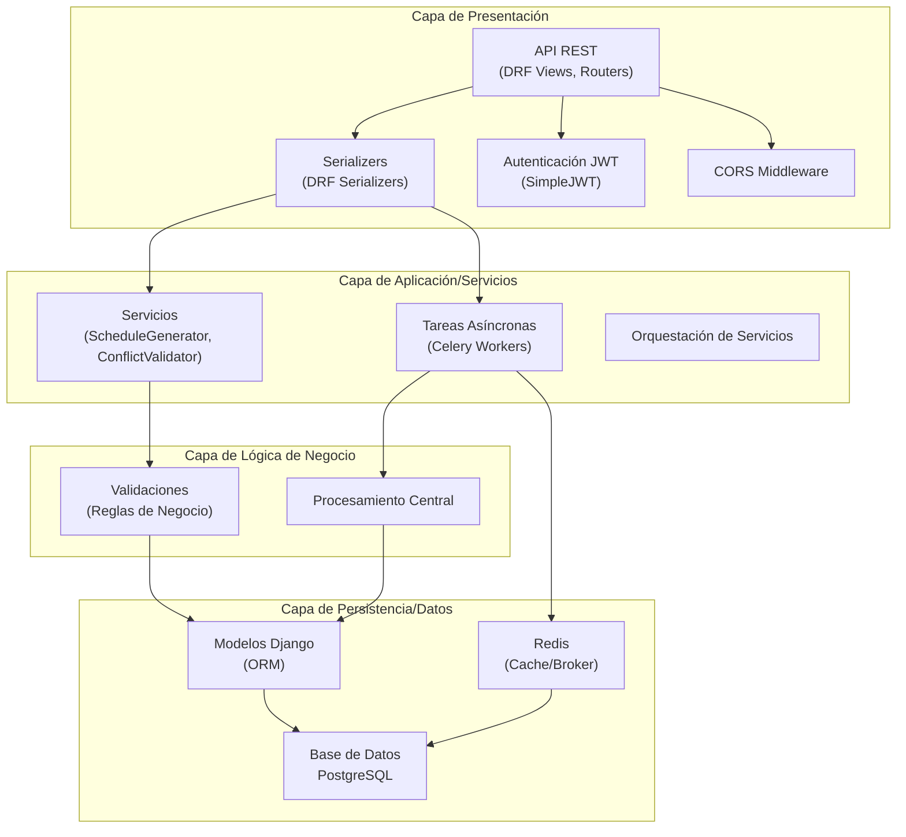
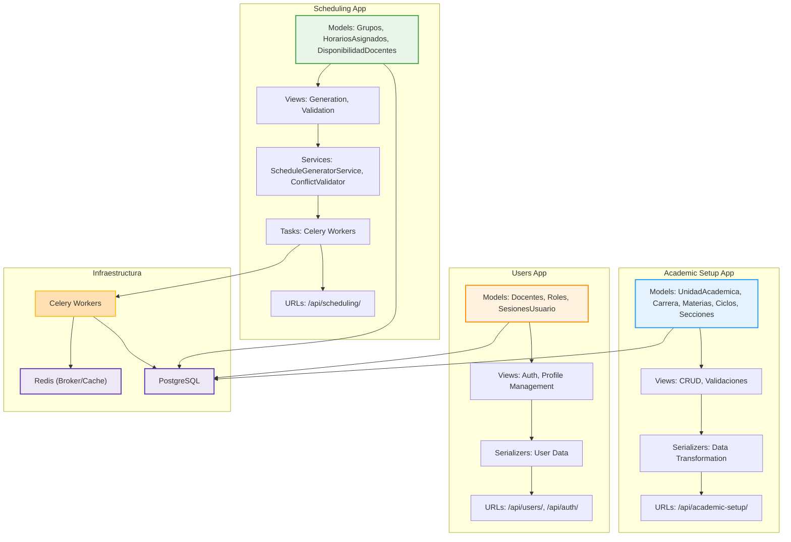
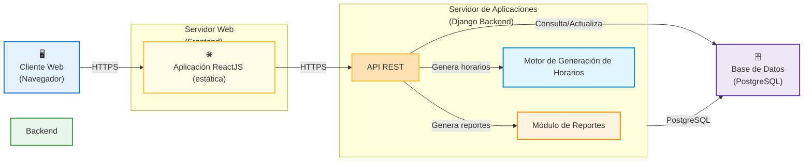

# 📋 INFORME: DIAGRAMAS DE ARQUITECTURA DEL BACKEND

## Sistema de Gestión de Horarios Académicos – Backend

---

## 1. Diagrama de Capas del Backend (N-Capas)

El backend del sistema está estructurado en **4 capas principales**, siguiendo una arquitectura en capas que favorece la separación de responsabilidades, la mantenibilidad y la escalabilidad. Cada capa tiene funciones, tecnologías y buenas prácticas asociadas:

### **Capa de Presentación**
- **Responsabilidad:** Exponer la API REST, recibir y responder solicitudes HTTP, serializar/deserializar datos.
- **Tecnologías/Módulos:** Django REST Framework (Views, Serializers, Routers), Autenticación JWT, CORS.
- **Buenas prácticas:** Validación temprana, manejo centralizado de errores, documentación OpenAPI/Swagger.

### **Capa de Aplicación/Servicios**
- **Responsabilidad:** Orquestar la lógica de negocio, coordinar servicios, gestionar tareas asíncronas.
- **Tecnologías/Módulos:** Servicios Python, Celery (tareas y workers), lógica de orquestación.
- **Buenas prácticas:** Servicios desacoplados, tareas idempotentes, logging estructurado.

### **Capa de Lógica de Negocio**
- **Responsabilidad:** Implementar reglas de negocio, validaciones complejas, procesamiento central.
- **Tecnologías/Módulos:** Validadores, reglas de negocio, servicios de dominio.
- **Buenas prácticas:** Reglas centralizadas, pruebas unitarias, separación de lógica de presentación.

### **Capa de Persistencia/Datos**
- **Responsabilidad:** Modelado de datos, acceso y manipulación de la base de datos, transacciones.
- **Tecnologías/Módulos:** Django ORM, PostgreSQL, migraciones, Redis (cache/broker).
- **Buenas prácticas:** Integridad referencial, uso de transacciones, optimización de queries, uso de índices.

#### **Relación con otros sistemas**
- **Celery:** Ejecuta tareas asíncronas, interactúa con la base de datos y Redis como broker/cache.
- **Redis:** Broker de mensajes para Celery y cache de datos temporales.
- **PostgreSQL:** Base de datos relacional principal.

---

### **Diagrama de Capas (Detallado)**

---

## 2. Diagrama de Componentes del Backend

Este diagrama muestra los principales **componentes lógicos y módulos** del backend, así como sus relaciones y responsabilidades. Cada app Django es un módulo independiente, con sus propios modelos, vistas, serializadores y URLs.

### **Academic Setup App**
- **Responsabilidad:** Configuración académica (unidades, carreras, materias, ciclos, secciones).
- **Componentes:**
  - Modelos: UnidadAcademica, Carrera, Materias, Ciclos, Secciones
  - Vistas: CRUD, validaciones de negocio
  - Serializadores: Transformación de datos
  - URLs: /api/academic-setup/

### **Users App**
- **Responsabilidad:** Gestión de usuarios, roles y autenticación.
- **Componentes:**
  - Modelos: Docentes, Roles, SesionesUsuario
  - Vistas: Autenticación, gestión de perfiles
  - Serializadores: Manejo de datos sensibles
  - URLs: /api/users/, /api/auth/

### **Scheduling App**
- **Responsabilidad:** Generación y validación de horarios, servicios y tareas asíncronas.
- **Componentes:**
  - Modelos: Grupos, HorariosAsignados, DisponibilidadDocentes
  - Servicios: ScheduleGeneratorService, ConflictValidator
  - Tareas: Celery Workers
  - URLs: /api/scheduling/

### **Relación con Celery y Redis**
- **Celery Workers:** Ejecutan tareas de generación de horarios, validación y auditoría.
- **Redis:** Broker de tareas y cache de resultados temporales.

---

### **Diagrama de Componentes (Detallado)**

---

## 3. Ventajas, Buenas Prácticas y Mejoras Futuras

### **Ventajas de la Arquitectura en Capas y Componentes**
- Separación clara de responsabilidades
- Facilita el mantenimiento y la escalabilidad
- Permite pruebas unitarias y de integración por módulo
- Favorece la reutilización de componentes
- Escalabilidad horizontal (Celery Workers, Redis)

### **Buenas Prácticas**
- Documentar cada capa y componente
- Usar migraciones para cambios en modelos
- Centralizar validaciones y reglas de negocio
- Implementar logging y monitoreo
- Proteger endpoints con autenticación y permisos

### **Posibles Mejoras Futuras**
- Separar servicios en microservicios independientes
- Implementar API Gateway y Service Discovery
- Mejorar la observabilidad (Prometheus, Grafana)
- Uso de Redis en producción como broker persistente
- Optimización de queries y uso de caché avanzado

---

## 4. Glosario Breve
- **DRF:** Django REST Framework, librería para construir APIs REST en Django.
- **Celery:** Framework para tareas asíncronas y procesamiento en background.
- **Redis:** Almacenamiento en memoria usado como cache y broker de mensajes.
- **ORM:** Object-Relational Mapping, mapeo entre modelos Python y tablas SQL.
- **CRUD:** Create, Read, Update, Delete (operaciones básicas de datos).
- **Worker:** Proceso que ejecuta tareas en background (Celery).

---

## 3.2.3.3. Diagrama de Despliegue

**Propósito**
El Diagrama de Despliegue representa cómo se distribuyen e interconectan los componentes físicos y lógicos del Sistema Automatizado de Gestión de Horarios Académicos (SGHA) dentro de la infraestructura tecnológica de "La Pontificia". Este modelo es clave para entender dónde reside cada parte del sistema, cómo se comunican entre sí y qué recursos físicos o virtuales son necesarios para su operación.

**Componentes principales desplegados:**

1. **Cliente Web (Navegador del usuario)**
   - Utilizado por docentes, coordinadores y administradores.
   - Accede al frontend vía HTTPS desde computadoras o dispositivos móviles.

2. **Servidor Web (Frontend)**
   - Alojado en un contenedor o bucket S3 (si es estático).
   - Entrega la aplicación ReactJS al navegador del cliente.

3. **Servidor de Aplicaciones (App Server)**
   - Alojado en un contenedor o máquina virtual (Linux).
   - Ejecuta el backend Django y expone la API REST.
   - Se comunica con la base de datos.

4. **Servidor de Base de Datos (PostgreSQL)**
   - Maneja la persistencia del sistema: docentes, materias, horarios, usuarios, etc.

**Justificación técnica**
- El uso de contenerización (Docker) o despliegue en la nube (AWS/Azure) permite escalabilidad y alta disponibilidad.
- La separación de frontend y backend favorece la mantenibilidad y actualización independiente.
- El uso de HTTPS garantiza la seguridad en las comunicaciones entre el cliente y los servidores.
- Se plantea el uso de un servidor de base de datos independiente para mejorar el rendimiento y facilitar los backups.

### Diagrama de Despliegue (Mermaid Detallado)

*Este informe complementa la documentación general y puede ser ampliado con nuevos diagramas o detalles según evolucione el sistema.* 